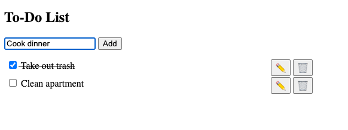

# [Tier 1] Programming HW0: Make a To-Do App with just HTML, CSS, and JS
## Simon Warchol

### How to Run
Serve the `HW0` directory using any http-server and access `index.html`.

###### Example:
```
npm i -g http-server
http-server .
```
Access assignment at  http://127.0.0.1:8080

### How to Use

Add new items to the list by typing them into the input field and pressing `Add`

Mark items as completed by clicking the checkbox

Edit items by pressing the pencil icon

Delete items by pressing the trash icon
